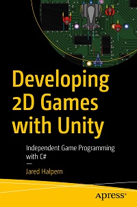

# Apress Source Code

This repository accompanies [*Developing 2D Games with Unity: Independent Game Programming with C#*](https://www.apress.com/9781484237717) by [Jared Halpern](https://jaredhalpern.com) (Apress, 2018).

[comment]: #cover


Download the files as a zip using the green button, or clone the repository to your machine using Git.

## Releases

Release v1.0 corresponds to the code in the published book, without corrections or updates.

## Contributions & Corrections

If you find any typos, errors in code, or otherwise incorrect information, please feel free to file an [Issue](https://github.com/Apress/Devel-2D-Games-Unity/issues) in GitHub. See the file [Contributing.md](https://github.com/Apress/Devel-2D-Games-Unity/blob/master/Contributing.md) for more information on how you can further contribute to this repository.

## Errata

#### Chapter 3, Page 53
Credit: [@omundy](https://github.com/omundy)

After stopping the playing scene, add the animation for the player's idle state. From the Sprites folder, select the last *two* sprites from the Player32x32 sprite-sheet, titled: `Player32x32_12` and `Player32x32_13` and drag them onto the PlayerObject. When prompted by the Create New Animation save window, name the created animation-clip, "player-idle" and save to the Animations -> Animations folder.

#### Chapter 4
Credit: [@josenerydev](https://github.com/josenerydev)

Issue with format of file: `OutdoorObjects.png`. (fixed in GitHub repo)

#### Chapter 4, Page 93

In the **Creating Tile Palettes** section, the `Tile Palette` window in Unity 2018.3 is now located under `Window -> 2D -> Tile Palette`.

#### Chapter 4, Page 128
Credit: [@omundy](https://github.com/omundy)

Make sure to attach the `RoundCameraPos` script to the virtual camera object. Drag and drop the `RoundCameraPos` onto "CM vcam1".

#### Chapter 4, Page 137
Credit: [@omundy](https://github.com/omundy)

The interface has been updated in Unity 2018.3. The menu item "Edit Physics Shape" has been renamed to "Custom Physics Shape". After selecting Custom Physics Shape, click the "Generate" button on the right before editing.

#### Chapter 5, Page 147 
Credit: [@omundy](https://github.com/omundy) 

Create the GameObject in the hierarchy view (not project view). 

#### Chapter 5, Page 162
Credit: [@omundy](https://github.com/omundy) 

In the **Assembling Our Item** section, third paragraph, rename the Scriptable Object, "Coin" (not "Item"). 

#### Chapter 5, Page 164
Credit: [@omundy](https://github.com/omundy) 

In the **Player Collisions** section, the first line of code section `// 3`, should be:

```
print("Hit: " + hitObject.objectName);
```

#### Chapter 5, Page 166
Credit: [@omundy](https://github.com/omundy)

Steps 10 and 11 are duplicates of step 3 and can be disregarded.

#### Chapter 6, Page 198
Credit: [@omundy](https://github.com/omundy)

Under the heading **Create the HealthBar Script**, right-click in the MonoBehaviours folder **and create a new C# script** called HealthBar."

#### Chapter 6, Page 202-204
Credit: [@omundy](https://github.com/omundy)

Ensure a copy of the `HealthBarObject` is in the Hierarchy view and select it. Add the HealthBar script this HealthBarObject. When working with the HealthBar in these next 3 pages (202-204), work with the copy of `HealthBarObject` in the Hierarchy view, not the copy in the Prefab folder. Make sure to apply changes when you're done, so the changes propagate to the Prefab.

**Note**: The location of the button to apply changes to a prefab has changed in Unity 2018. The button is now located in the top right of the Inspector, in a drop-down menu called Overrides.

#### Chapter 6, Page 204
Credit: [@omundy](https://github.com/omundy)

The property, `Character Category` which appears in the source and in Figure 6-22 may be disregarded, or used later on in your game to broadly distinguish between what is/isn't an enemy, or the player (or even an NPC) instead of creating a tag for each character type.

#### Chapter 6, Page 207
Credit: [@omundy](https://github.com/omundy)

With `InventoryObject` selected, in the Canvas Scaler component, set `Reference Pixels Per Unit` to 32.


#### Chapter 7, Page 263
Credit: [@omundy](https://github.com/omundy)

In the **The DamageCharacter() method** section, the code should be added to the `Enemy` class.


#### Chapter 7, Page 269
Credit: [@omundy](https://github.com/omundy)

In the **Refactoring Prefab Instantiation** section, remove all *four* lines from `Start()` and add them to the new `ResetCharacter()` override.

After you add the `ResetCharacter()` method to the `Player` class, add the following method

```
private void OnEnable() {
	ResetCharacter();
}
```

#### Chapter 7, Page 275
Credit: [@omundy](https://github.com/omundy)

You'll notice when you run into the enemies they spin. Like you did with the PlayerObject, check `Freeze Rotation` for the Z axis inside the Rigidbody2D on the EnemyObject prefab.


#### Chapter 8, Page 287
Credit: [@omundy](https://github.com/omundy)

In the **Enemy Walk Animation** section, select the Enemy prefab then open the **Animator** window as seen in Figure 8-3.


#### Chapter 8, Page 357
Credit: [@VADS](https://github.com/VADS)

In the implementation of the `GetQuadrant()` method, disregard the first two variable declarations: `Vector2 mousePosition = Input.mousePosition;` and `Vector2 playerPosition = transform.position;` as they are not used.


